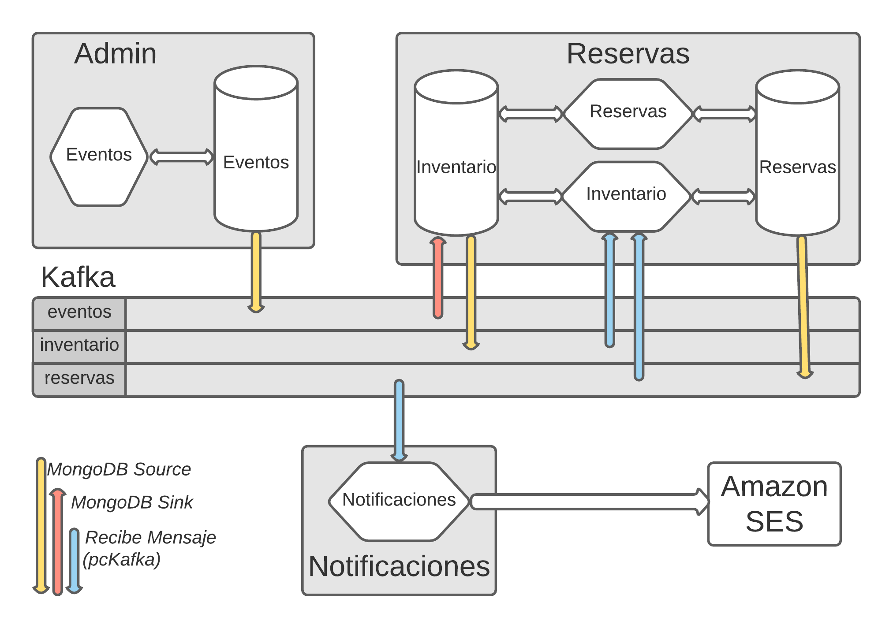

##Prueba de concepto: Boletia, una aplicación (simplificada) para venta de boletos,  basada en microservicios event-driven.
**Desarrollada sobre Kubernetes, un cluster Kafka (3 brokers), un cluster MongoDB (3 réplicas), Kafka Connect y MongoDB Connector, y un módulo go, pcKafka, productor-consumidor de Kafka.**


En repositorios anteriores hemos publicado como hacer un deploy de Kafka (3 brokers) y MongoDB (3 réplicas):

https://github.com/avaco2312/kubernetes-kafka-cluster
https://github.com/avaco2312/kubernetes-mongodb-replicaset

Tenemos entonces un broker de mensajes Kafka y una base de datos MongoDB tolerantes a fallos, que nos garantizan un estado resiliente del sistema (en un caso real, las instancias deberían ubicarse en diferentes servidores, redes, optimizarlas, etc)

Basado en ello haremos la prueba de concepto de desarrollar una aplicación constituida por microservicios (sólo el backend). Hemos tomado como modelo (simplificado) una aplicación de ventas de boletos para eventos (conciertos, teatro, eventos deportivos, etc). 

El repositorio lo analizaremos en dos partes:

- Integrar los cluster de Kafka y MongoDB, a través de Kafka Connect, MongoDB Connect y de un módulo que hemos escrito en go, pcKafka, para enviar y recibir mensajes hacia y desde tópicos de Kafka.
- Implementar los microservicios y la aplicación.

El lanzamiento del repositorio en Kuberenetes (Kind) se realiza mediante el archivo comandos.bat, que hace el deploy de kafka.yaml, mongo.yaml, kafka-mongo-connect.yaml, clientes.yaml e ingress.yaml. Los dos primeros se explicaron en los anteriores repositorios. Aquí se han integrado y modificado para que el deploy sea en los namespaces Kubernetes kafka y mongo, respectivamente. El deploy de Ingress, ingress.yaml, es similar también a lo visto antes. Los otros yaml, kafka-mongo-connect.yaml y clientes.yaml los veremos ahora.

Dos de los patrones más comunes en microservicios manejados por eventos (event-driven) son:
  
- Modificar un almacenamiento (MongoDB, en nuestro caso) y transmitir los cambios a otros microservicios dependientes, mediante un broker de mensajes (en este caso, Kafka).
- Recibir un cambio de un micro-servicio anterior, mediante un mensaje (Kafka), y modificar un almacenamiento (MongoDB).

Debemos preguntarnos que pasa si la primera parte de estas premisas se ejecuta y la segunda falla, por ejemplo, si en un microservicio modificamos un registro de MongoDB y fallamos al enviar el mensaje de Kafka que informa esa modificación a otros microservicios dependientes. De suceder esto, y también en el segundo caso, recibir mensaje y fallar en actualizar el almacenamiento, se produciría una inconsistencia permanente en el estado de la aplicación.

Existen soluciones para esta problemática, empecemos con el caso de comunicación Kafka-MongoDB. Una solución eficiente es Kafka Connect.

Kafka Connect es una herramienta para, de forma escalable y fiable, transmitir datos entre Apache Kafka y otros sistemas, como MongoDB. Funciona ejecutando Kafka Connect, agregándole los plugins que se necesiten. Existen múltiples plugins, para comunicarse con diferentes sistemas, como bases de datos relacionales, noSQL, el sistema de archivos, etc. Aquí usaremos Kafka Connect con el pluging MongoDB Kafka Connector.

Lanzamos una instancia de Kafka Connect, con el plugin MongoDB Connect, mediante kafka-mongodb-connect.yaml. Hay otras formas de ejecutar Connect, aquí usamos la más simple, standalone y con sólo un nodo de Connect.

El contenedor usado pare el deploy de Kafka Connect lo preparamos previamente (Dockerfile en el subdirectorio kafka-mongodb-connect). Partimos de una imagen de bitnami/kafka (Connect viene incluido en esta distribución de Kafka) y agregamos (copiamos) el plugin MongoDB Kafka Connector, mongo-kafka-connect-1.6.1-all.jar, que bajamos del sitio de MongoDB. También copiamos el archivo init.sh que se ejecutará al iniciar el contenedor.

Este shell copia los archivos de configuración necesarios al directorio adecuado del contenedor. Los archivos de configuración se suministran al contenedor al momento del deploy en Kubernetes, mediante un ConfigMap, connect-init (kafka-mongodb-connect.yaml), que se monta como volumen y los hace disponibles dentro del sistema de archivo del contenedor, permitiendo la copia mencionada. De esta forma son fáciles de modificar sin tener que recrear la imagen del contenedor.

A continuación init.sh ejecuta el script, incluido en Kafka, para iniciar Connect (connect-standalone.sh), pasando como argumentos los archivos de configuración copiados. 

El primer archivo de configuración, connect-standalone.properties, tiene los parámetros para inicializar Kafka Connect, entre ellos, la dirección del broker kafka al que se conectará, el directorio donde encontrará los plugins para conectar con el sistema externo (en este caso el plugin MongoDB Connect), etc.

El segundo archivo de configuración, mongo.source.properties, inicializa un MongoDB Source Connector, que hará que los cambios (inserción, update o delete de documentos) en las colecciones de MongoDB generen mensajes en tópicos de Kafka. Indicamos el cluster MongoDB a conectar y, al no especificar nada sobre una colección o BD específica, hará que cualquier modificación en la BD genere un mensaje. 

El archivo de configuración mongo.sink.properties inicializa un MongoDB Sink Connector. Este permite que, al recibir un mensaje en un tópico Kafka, se realice una modificación en una colección MongoDB. Para nuestro caso sólo necesitamos conectar un tópico, boletia.eventos, con la colección inventario, aunque de ser necesario se pueden especificar más conexiones. El documento en formato JSON que llegue en el mensaje del tópico boletia.eventos deberá tener la estructura deseada para la colección inventario. 

La concepción de nuestra aplicación define sólo hacer inserciones o updates de las colecciones (no hay delete). Con el MongoDB Source y Sink ¿qué tememos?

- Una inserción o update en una colección de la BD, genera un mensaje en el correspondiente tópico de Kafka, que contiene el documento tal como quedó.
- Un mensaje en el tópico kafka.eventos inserta o hace update de un documento en la colección inventario.
- En especial, en el caso de crear o modificar un documento en la colección eventos, se genera un mensaje en el tópico Kafka boletia.eventos y se crea o se modifica un documento en la colección inventario. El documento en inventario será un "clone" del contenido en eventos.

En el esquema del inicio las flechas amarillas señalan los mensajes que se escriben en un tópico a partir del cambio en una colección, debido al MongoDB Source. La flecha roja, la creación de un tópico en la colección inventario a partir de un mensaje de Kafka en el tópico boletia.eventos.

Podemos probar que esto funcione. Para ello usaremos los clientes de nuestra aplicación, aunque todavía no los detallemos. Su definición está en clientes-go y el deploy Kubernetes en clientes.yaml

El cliente "eventos" escucha internamente en el puerto 8070, y mediante Ingress es accesible en localhost/eventos. Permite crear y ver los eventos, en la colección eventos.

Podemos crear un evento mediante:

```code
curl -X POST http://localhost/eventos
-d '{
        "nombre":   "Opera Boheme",
        "capacidad": 20,
        "categoria": "Opera"
    }'

HTTP/1.1 200 OK
Date: Mon, 22 Nov 2021 22:37:05 GMT
Content-Type: text/plain; charset=utf-8
Content-Length: 126
Connection: close

{
  "Id": "619c1b9190812c00013e29c1",
  "Nombre": "Opera Boheme",
  "Capacidad": 20,
  "Categoria": "Opera",
  "Estado": "A"
}
```
Podemos consultar el evento creado con:
```code
curl -X GET http://localhost/eventos/Opera%20Boheme

HTTP/1.1 200 OK
Date: Mon, 22 Nov 2021 22:38:28 GMT
Content-Type: application/json;charset=utf8
Content-Length: 106
Connection: close

{
  "Id": "619c1b9190812c00013e29c1",
  "Nombre": "Opera Boheme",
  "Capacidad": 20,
  "Categoria": "Opera",
  "Estado": "A"
}
```

El cliente "reservas" escucha internamente en el puerto 8071, y lo hacemos accesible en localhost/reserva mediante Ingress. Con el path localhost/reserva/eventos leemos de la colección inventario.

Podemos ver que el tópico creado en boletia.eventos se duplica en boletia.inventarios:

```code
curl -X GET http://localhost/reservas/eventos/Opera%20Boheme

HTTP/1.1 200 OK
Date: Mon, 22 Nov 2021 22:42:31 GMT
Content-Type: application/json;charset=utf8
Content-Length: 107
Connection: close

{
  "Id": "619c1ca490812c00013e29c3",
  "Nombre": "Opera Boheme",
  "Disponible": 20,
  "Categoria": "Opera",
  "Estado": "A"
}
```
Mediante Kafka Connect y el plugin MongoDB Connect hemos logrado que una actualización de cualquier colección de la base de datos boletia produzca un mensaje en el correspondiente tópico de Kafka, boletia.(nombre de la colección). Además, al recibir un mensaje en el tópico boletia.eventos, se crea un documento en la colección boletia.inventario, que es copia del creado o modificado en la colección eventos. Y lo más importante, este procesamiento se hace de forma automática, fiable y consistente.

Pero hay situaciones en las que este mecanismo de comunicación no es lo que necesitamos. Por ejemplo, creamos una reserva de un cliente (un documento en MongoDB) y se genera un mensaje en un tópico de Kafka. Con ese mensaje el objetivo no es crear otro documento MongoDB, si no usar los datos que contiene para enviar una notificación al cliente, mediante un servicio de email externo. 

Otro ejemplo es el caso de recibir un mensaje Kafka para crear un documento MongoDB, pero este no es una una copia exacta del documento contenido en el mensaje. Necesitamos antes transformar los datos y procesarlos, para obtener el documento a insertar o modificar en MongoDB. Para este caso se han hecho extensiones a Kafka, que aquí no veremos.

En general hay dos situaciones:

- Hacemos un procesamiento (actualizar una base de datos, por ejemplo) y enviamos un mensaje a un tópico de Kafka (que será usado por otros micro-servicios).
- Recibimos un mensaje en un tópico de Kafka y en base a él hacemos un procesamiento (por ejemplo, transformamos los datos y actualizamos una base de datos, o leemos los datos y en base a ellos enviamos un email).

Ambos casos conllevan dos partes, el primero, 1) procesar 2) enviar mensaje, el segundo, 1) leer mensaje 2) procesar. Y en ambos casos debemos pensar sobre la integridad y la consistencia al ejecutarlos (y también la escalabilidad, como veremos más adelante). 

Si lo hacemos sin ninguna consideración no existirá garantía de que la primera parte y la segunda se realicen ambas o fallen ambas. De fallar una, la aplicación llegaría a un estado "inconsistente". Por ejemplo, actualizamos el inventario de un evento, disminuyendo la cantidad de boletos de una reserva, enviamos un mensaje con la reserva a otro microservicio, el mensaje no llega y por lo tanto, la reserva en sí no se registra, estando ya afectado el inventario del evento. O registramos una reserva pero no se le manda el email de confirmación al cliente.

Se pueden implementar mecanismos que nos garanticen una consistencia eventual, esto es, que nuestra aplicación llegue siempre a un estado consistente, salvo fallos permanentes en la red y/o en los nodos de proceso. Cómo hemos hecho el deploy en Kubernetes con un cluster de varios nodos de Kafka y MongoDB con replicas, podemos esperar que estos fallos también sean superados (como ya comentamos, en la vida real esto llevaría a hacer el deploy en diferentes máquinas, redes, redundancia, etc. Y así y todo...). Estos mecanismos ya están implícitos cuando usamos Kafka Connect, de ahí su fiabilidad. 

De los dos casos antes mencionados, el primero no se presenta en nuestra futura aplicación, procesamiento-mensaje. ¡Por suerte! los mecanismos a implementar para garantizar consistencia son complicados y con penalidad en el rendimiento y la escalabilidad, ver una discusión en https://debezium.io/blog/2019/02/19/reliable-microservices-data-exchange-with-the-outbox-pattern/)

El segundo caso sí lo necesitamos, recibir un mensaje y hacer un procesamiento, de forma eventualmente consistente.

Si prescindimos de Kafka Connect, la comunicación debemos manejarla nosotros. Y para ello hemos generalizado un módulo para enviar y recibir mensajes a tópicos de Kafka. El código en clientes-go/pcKafka (producer y consumer de Kafka). El "productor" de mensajes, envia mensajes a un tópico, y como dijimos, no nos será necesario en este  proyecto. Su funcionamiento es similar al presentado en el repositorio anterior sobre el cluster de Kafka.

El "consumidor" de mensajes lo hemos re-escrito. Ahora se presenta como una función, RecibeMensajes, que permite a un cliente suscribirse a uno o varios tópicos de Kafka. Mediante channels de go esta función devuelve los mensajes (y los errores, si los hubiera) que se van recibiendo en los tópicos de Kafka. Detalles importantes:

- A la función le pasaremos, además de los tópicos a suscribir, un consumer-group de Kafka, único para cada cliente (usamos el nombre del cliente). Esto permite que Kafka registre internamente que mensajes ha leído y confirmado cada cliente. Kafka nos suministra los mensajes en el orden en que fueron creados, si se confirma el mensaje como procesado, pasa al siguiente (no re-envía los mensajes confirmados, pero si no se confirma, por cualquier causa, sigue enviando ese mensaje).
- Usamos para leer un mensaje la llamada FetchMessage, que lee el mensaje pero no lo confirma. Es responsabilidad del cliente que recibe el mensaje (en el channel go), realizar el procesamiento requerido y confirmar a Kafka el mensaje, o no. 

Esto permite implementar un mecanismo de consistencia basado en que "al menos una vez se recibe cada mensaje". Nuestro cliente se suscribe a los mensajes de un tópico. Recibe un mensaje y lo procesa, si el resultado es satisfactorio, confirma el mensaje a Kafka como procesado. Si se produce un error en el procesamiento, bien por nuestro cliente en sí, o por un fallo de la BD o de la red, incluso un fallo en el envío de la confirmación a Kafka, la confirmación no se produce y Kafka no pasa al mensaje siguiente, volverá a enviar ese mismo mensaje.

Si bien esto asegura que un mensaje siempre sea procesado (a pesar de los eventuales fallos), crea la posibilidad de que un mensaje ya procesado por el cliente se reciba más de una vez. Por ejemplo, leemos el mensaje, insertamos un documento en MongoDB y enviamos la confirmación del mensaje, pero esta no llega a Kafka por un problema en la red. Kafka, más adelante, re-envía el mensaje al no verlo confirmado.

Es responsabilidad de nuestro cliente manejar estos casos. Una solución es hacer nuestro cliente "idempotente", esto es, si recibimos un mensaje más de una vez, garantizamos que el resultado es el mismo que si lo recibimos sólo una. En el ejemplo mencionado en el párrafo anterior, si llega un mensaje repetido, un índice único de MongoDB hace que la nueva inserción falle (documento ya existente). En este caso también confirmamos el mensaje a Kafka, para que no lo vuelva a enviar y pase al siguiente.

Hemos creado un cliente, inventario (código en clientes-go/inventario), que se suscribe a los tópicos de Kafka boletia.inventario y boleta reservas. Es un cliente "silente", no expone un puerto ni crea un servicio Kubernetes. Se inicializa mediante un deployment (en clientes.yaml) y se queda "escuchando" esos tópicos para procesar los mensajes que se reciban. 

Veamos como procesa los mensajes del tópico reservas. Los mensajes que llegan a este tópico se generan, mediante el MongoDB Source, al crearse o modificarse un documento en la colección reservas. Habrá dos casos, crear una reserva y cancelarla, veremos este último.

Cancelar una reserva lleva dos pasos, marcarla como cancelada (al campo estado se le asigna "X"). Esto es un update en la colección reservas que genera un mensaje en el tópico boletia.reservas. Y necesitamos ahora devolver los boletos que ocupaba esta reserva a la cantidad disponible en el correspondiente evento, reflejado en un documento de la colección inventario. Luego este es un caso donde recibimos un mensaje y no se trata de insertarlo en una colección, sino que lleva un procesamiento: basado en los datos  recibidos, una reserva cancelada, actualizar la cantidad disponible, en el documento del evento, colección inventario.

No nos preocuparemos ahora de la consistencia de toda la operación "cancelar reserva", sólo veremos la consistencia del mecanismo "recibir mensaje de cancelación y garantizar su procesamiento" que es una de las cosas que hace el cliente "silente" inventario.

Empecemos por crear una reserva y cancelarla, para ello usamos el cliente reservas antes mencionado, que expone también las llamadas necesarias:

```code
curl -X POST http://localhost/reservas
-d '{
        "evento":   "Opera Boheme",
        "cantidad": 3,
        "email": "pepediaz@gmail.com"
    }'
}

HTTP/1.1 200 OK
Date: Mon, 22 Nov 2021 22:46:06 GMT
Content-Type: text/plain; charset=utf-8
Content-Length: 111
Connection: close

{
  "Id": "619c1dae4b21200001952449",
  "Evento": "Opera Boheme",
  "Estado": "A",
  "Email": "pepediaz@gmail.com",
  "Cantidad": 3
}
```

Esto además genera un mensaje en boletia.reservas, que contiene una copia del documento. Observe que el estado al crear la reserva es "A" (activa).

Podemos ahora cancelar esta reserva.

```code
curl -X DELETE http://localhost/reservas/619c1dae4b21200001952449

HTTP/1.1 200 OK
Date: Mon, 22 Nov 2021 22:48:03 GMT
Content-Type: text/plain; charset=utf-8
Content-Length: 111
Connection: close

reserva Id: 619c1dae4b21200001952449 Cliente: pepediaz@gmail.com Evento: Opera Boheme cancelada
```
Esto hace un update de la reserva pasando el estado a "X" y genera otro mensaje en boletia.reservas con el contenido actual del documento (reserva con estado "X).

Podemos ver como procesa estos mensajes el cliente inventario (clientes-go/inventario).

Primero crea los go channels necesarios para recibir los mensajes y llama a pcKafka.RecibeMensajes, para suscribirse a los dos tópicos de su interés.

```code
err := pcKafka.RecibeMensajes(kafkaURL, "inventario", []string{"boletia.inventario", "boletia.reservas"}, par, rep, mensajes, errores)
```

Después se queda en un ciclo infinito esperando por mensaje (o errores). De recibir un mensaje llama a la función procesaMensajes, donde hemos definido el procesamiento necesitado. Esta función devolverá err nil indicando procesamiento correcto. En este caso se le confirma el mensaje a Kafka como procesado. En caso contrario no se confirma y Kafka lo reenviará más adelante.

A procesaMensajes llegan los mensajes de dos tópicos, por lo que discrimina su procesamiento. Veamos la parte que procesa boletia.reservas.

```code
case "boletia.reservas":
	reserva := contratos.Reserva{}
	err = json.Unmarshal([]byte(b), &reserva)
	if err != nil {
		return err
	}
	if reserva.Estado != "X" {
		return nil
	}
```
Desempaquetamos el documento que viene en el tópico en una estructura de Go que contendrá la reserva. Al tópico llega un mensaje al crear la reserva, con estado "A", o al cancelarla, "X". Sólo es necesario procesamiento al cancelar, aumentar el inventario, por lo que descartamos el caso "A" y devolvemos nil, para que se confirme el mensaje y Kafka pase al siguiente.

El procesamiento de una cancelación a continuación. Se realiza mediante una operación findAndModify de MongoDB, que en la librería go-mongoDB que utilizamos lleva una definición del cambio a realizar, (change mgo.Change) y, sobre la colección inventario, hacer un Find del evento en cuestión y un Apply del change definido.

```code
ses := sep.Copy()
defer ses.Close()
change := mgo.Change{
	Update: bson.D{
		{Name: "$inc", Value: bson.D{{Name: "capacidad", Value: reserva.Cantidad}}},
		{Name: "$set", Value: bson.D{{Name: "idres", Value: reserva.Id},
			{Name: "email", Value: reserva.Email},
			{Name: "canres", Value: -1},
		}},				
	},
}
_, err = ses.DB("boletia").C("inventario").
	Find(bson.D{
		{Name: "nombre", Value: reserva.Evento},
		{Name: "estado", Value: "A"},
	}).Apply(change, &reserva)
if err == mgo.ErrNotFound {
	return nil
}
return err
```

Sin entrar en todos los detalles:

- El change es un update al evento correspondiente a la reserva, cuyo documento se localiza en el Find mediante nombre == reserva.Evento (escrito en bson). Se chequea que el estado del evento (no de la reserva) es "A", activa. Esto para el raro caso de que, en el interim entre que el cliente canceló de la reserva y este momento, el cliente de Admin (los administradores de eventos) haya cancelado el evento (no la reserva). En ese caso ya no importa actualizar el inventario de un evento cancelado en su totalidad.
- El change define una actualización, update, que incrementa la disponibilidad del evento en la cantidad de boletos que ocupaba la reserva cancelada (escrito en bson)

```code
{Name: "$inc", Value: bson.D{{Name: "capacidad", Value: reserva.Cantidad}}}
```
- Una aclaración, al crearse el documento evento en inventario, mediante la copia automática desde eventos (Source-mensaje-Sink), el campo sigue llamándose capacidad, pero en el inventario le damos el significado de disponibilidad. Al crear el evento tiene toda la capacidad inicial, disminuyendo con las reservas y aumentando con las cancelaciones. Lo hemos dejado así por simplicidad, pero en los clientes que muestran el inventario cambiamos al dar el resultado y lo mostramos como disponibilidad.
- Hay otros campos que se actualizan o se insertan en el documento, pero corresponden a un mecanismo que veremos más adelante
- El resultado de la operación define si confirmamos o no el mensaje. Si el resultado es documento no encontrado (err == mgo.ErrNotFound) sólo puede deberse a que el evento existe y su estado no es activo (el caso de evento cancelado antes mencionado). Devolvemos nil para confirmar el mensaje y pasar al siguiente. Cualquier otro error indica algo que no debe pasar, ajeno a la lógica (malfuncionamiento o caída de MongoDB, problemas en la red, etc), devolvemos el error, no se confirma el mensaje y esperemos más suerte la próxima vez que Kafka lo envíe. Si el update es satisfactorio, se devuelve nil y se confirma el mensaje.
- Por simplicidad del ejemplo, nuestro cliente inventario escucha dos tópicos de Kafka. Realmente deberían separarse en dos clientes, para que el procesamiento de un tópico no interfiera con el otro, y también para su monitoreo, escalabilidad, etc.

Podemos ver el resultado en el inventario al hacer la reserva y al cancelarla.

Al hacer la reserva:

```code
curl -X GET http://localhost/reservas/eventos/Opera%20Boheme

HTTP/1.1 200 OK
Date: Mon, 22 Nov 2021 22:42:31 GMT
Content-Type: application/json;charset=utf8
Content-Length: 107
Connection: close

{
  "Id": "619c1ca490812c00013e29c3",
  "Nombre": "Opera Boheme",
  "Disponible": 17,
  "Categoria": "Opera",
  "Estado": "A"
}
```

Después de canecalrla:

```code
curl -X GET http://localhost/reservas/eventos/Opera%20Boheme

HTTP/1.1 200 OK
Date: Mon, 22 Nov 2021 22:42:31 GMT
Content-Type: application/json;charset=utf8
Content-Length: 107
Connection: close

{
  "Id": "619c1ca490812c00013e29c3",
  "Nombre": "Opera Boheme",
  "Disponible": 20,
  "Categoria": "Opera",
  "Estado": "A"
}
```

Podemos pasar ahora a la segunda parte, comentar la implementación de los microservicios y de la aplicación.

Recordemos el esquema inicial.


De la aplicación sólo implementamos, muy simplificado, el backend (se agradecen colaboraciones para el frontend). También hemos simplificado en casi todos los aspectos, obviado validaciones, configuraciones por default y un largo etc. Y aunque todo el deploy lo hemos hecho sobre un cluster Kubernetes, un cluster Kafka, un cluster MongoDB y una computadora, en un caso real casi seguro que no sería así. 

La aplicación cubre tres dominios: Administración, Reservas y Notificaciones (cuadrados sombreados). A su vez contienen uno o más microservicios y bases de datos (hexágonos y cilindros). Todos ellos conectados por un cluster de Kafka, con tres tópicos, del mismo nombre que la colección que los genera. Las líneas amarillas denotan los mensajes creados por el MongoDB Source a partir de la colección y la roja, la creación de un documento a partir de un mensaje. Las líneas azules los mensajes leídos y procesados por microservicios.

Admin, es el dominio administrativo. Aquí es donde se definen los eventos y toda su logística. Aunque solo implementamos la creación de eventos y su cancelación, esta área pudiera cubrir toda la conformación del servicio, los contratos con los proveedores, las estadísticas, contabilidad y finazas, etc. Aunque en la simplificación que implementamos, el microservicio y la colección que usa los hemos creado en el cluster, posiblemente tendría más sentido como parte del sistema de la empresa y fuera del cluster de reservas. Sus usuarios estarían casi seguro limitados a los empleados y requerirían flexibilidad y capacidad de consulta "ad-hoc". Así que a lo mejor la base de datos sería relacional, no NOSQL.

El microservicio eventos (código en clientes-go/eventos y deploy clientes.yaml) implementa los puntos de acceso:

```code
r.HandleFunc("/eventos", getEventos).Methods("GET")
r.HandleFunc("/eventos/{nombre}", getEvento).Methods("GET")
r.HandleFunc("/eventos", postEvento).Methods("POST")
r.HandleFunc("/eventos/{nombre}", deleteEvento).Methods("DELETE")
```

Los dos primeros (GET) recuperan eventos. El primero todos los eventos existentes, el segundo un evento por su nombre. El POST crea un evento (con estado activo "A") y el DELETE cancela un evento (no lo borra, le cambia el estado a cancelado "C"). No hemos implementado modificaciones a eventos existentes para simplificar.

La estructura de un evento en la colección:

```code
{
  "Id": "619c1b9190812c00013e29c1",
  "Nombre": "Opera Boheme",
  "Capacidad": 20,
  "Categoria": "Opera",
  "Estado": "A"
}
```

El área Reservas maneja todo lo relacionado con hacer o cancelar reservas, atendiendo directamente a los clientes que, a través del frontend público, interactúan. Esta si tiene sentido que esté en un cluster y/o en la nube, con consideraciones de alta disponibilidad y escalabilidad, optimizada para un número elevado de peticiones concurrentes.

La dividimos en dos microservicios que interactúan con dos colecciones y con los tópicos de Kafka. Como ya dijimos para uno de ellos, hemos simplificado, pero cada uno de estos servicios deberían separarse, aislando sus interacciones a una colección y un tópico.

Veamos primero lo que ocurre de manera "silente" en la colección inventario, una de las que se utilizan en el área Reservas. Al crear un evento se crea también una copia en inventario (source - mensaje - sink). Así que inicialmente la estructura del documento creado en inventario es:

```code
{
  "Id": "619c1b9190812c00013e29c1",
  "Nombre": "Opera Boheme",
  "Capacidad": 20,
  "Categoria": "Opera",
  "Estado": "A"
}
```

Recordar que en inventario interpretaremos capacidad como disponibilidad. También note que la Id es la misma que la que se asignó en la colección eventos.

Si los administradores, en Admin, cancelan el evento, también nuestra copia en inventario se actualiza con estado "C". Esto impide que se puedan realizar nuevas reservas. Y ¿que pasa con las reservas ya existentes? Bueno, las modificaciones de inventario generan a su vez mensajes, ahora en el tópico boletia.inventarios, que el microservicio inventario usará para propagar las cancelaciones a las reservas. Lo veremos después.

De los dos microservicios del área Reservas uno expone puntos de acceso al frontend. Es el microservicio reservas (si, mucha duplicación de nombres, me disculpo y en parte fue la motivación para dibujar el esquema como orientación).

Los puntos de acceso GET del microservicio reservas son:
```code
r.HandleFunc("/reservas/eventos", getEventos).Methods("GET")
r.HandleFunc("/reservas/eventos/{nombre}", getEvento).Methods("GET")
r.HandleFunc("/reservas/{evento}/{email}", getReservasCliente).Methods("GET")
r.HandleFunc("/reservas/{id}", getReservaId).Methods("GET")
```
El primero lista todos los eventos que están en el inventario y la capacidad que tienen disponible. El segundo lista un evento determinado. Les serán necesarios al frontend para comenzar el proceso de reserva.

El tercero lista todas las reservas que para un evento ha hecho un cliente (identificado por su email). Un cliente puede tener varias reservas para un mismo evento, a las que se asignan diferentes Id de reserva. Y el último permite listar los datos de una reserva específica, identificada por su Id. Estos accesos son necesarios como datos previos a que el frontend gestione las modificaciones a una reserva existente (en este caso la única opción implementada es cancelarla).

Un ejemplo de reserva es:

```code
{
  "Id": "619c1dae4b21200001952449",
  "Evento": "Opera Boheme",
  "Estado": "A",
  "Email": "pepediaz@gmail.com",
  "Cantidad": 3
}
```

Los puntos de acceso para modificar las reservas son:

r.HandleFunc("/reservas", postReserva).Methods("POST")
r.HandleFunc("/reservas/{id}", deleteReservaId).Methods("DELETE")

El primero crea una reserva y el segundo la cancela (realmente la modifica, pasando su estado de "A" a "X)(segunda nota: las reservas canceladas realmente serán de dos categorías "C" y "X", la primera cuando los administradores cancelan el evento y se interpreta como "evento suspendido por los organizadores". La segunda "X" es la que maneja este microservicio y significa "cancelada a petición del cliente")

Veamos la creación de una reserva. La llamada ya la vimos, la repetimos:

```code
curl -X POST http://localhost/reservas
-d '{
        "evento":   "Opera Boheme",
        "cantidad": 3,
        "email": "pepediaz@gmail.com"
    }'
}
```
Implica dos acciones, rebajar la cantidad de boletos pedidos en el inventario y registrar la reserva en reservas. Y tenemos de nuevo un problema de lograr la atomicidad de las dos operaciones para garantizar la consistencia del sistema. Existen varias opciones:

- Agregar la reserva como un subdocumento del documento del evento en el inventario y así hacer la actualización en una sola operación de MongoDB sobre inventario, lo que garantiza su atomicidad. Tiene el inconveniente de que el documento del evento se haría cada vez más grande. MongoDB tiene un límite de 16 Mb que aunque amplio pudiera sobrepasarse. Y además, en eventos con muchas reservas (un partido de fútbol) el tamaño del documento degradaría el rendimiento y la concurrencia en caso de muchos clientes accediendo al evento.
- Pudiéramos actualizar el inventario y crear la reserva dentro de una transacción de MongoDB. Pero esto también penalizaría el rendimiento y la capacidad de concurrencia ante muchos pedidos simultáneos y en general, la escalabilidad del microservicio en situaciones de carga.
- La opción que usaremos va con la filosofía de microservicios event-driven. Teniendo una comunicación fiable y consistente, podemos hacer que el microservicio actualice el inventario y de forma simultánea envíe un mensaje, que a su vez será leído por otro microservicio que se encargará de registrar la reserva. Observe que el orden es importante, tal como haría un vendedor en un mostrador: primero actualizar el inventario (tachar los asientos en el mapa de la sala y, claro, cobrar). Después emitir los boletos.

Para crear la reserva el microservicio reservas actualiza la colección inventario. Disminuimos en el documento del evento la cantidad de boletos pedidos. Pero en esa modificación también agregamos campos con los datos de la reserva. La actualización de la colección inventario genera un mensaje en boletia.inventario, que contiene el evento más los datos de la reserva. El otro microservicio, inventario, recibe este mensaje y registra la reserva.

Veamos algo del código del microservicio reservas, que usa también la operación MongoDB findAndModify.

```code
change := mgo.Change{
	Update: bson.D{
		{Name: "$inc", Value: bson.D{{Name: "capacidad", Value: -reserva.Cantidad}}},
		{Name: "$set", Value: bson.D{{Name: "idres", Value: reserva.Id},
			{Name: "email", Value: reserva.Email},
			{Name: "canres", Value: reserva.Cantidad},
		}},
	},
}
_, err = ses.DB("boletia").C("inventario").
	Find(bson.D{
		{Name: "nombre", Value: reserva.Evento},
		{Name: "estado", Value: "A"},
		{Name: "capacidad", Value: bson.D{{Name: "$gt", Value: reserva.Cantidad - 1}}},
	}).Apply(change, &reserva)
```

El Find busca en inventario el evento correspondiente a la reserva y verifica que esté activa. El change especifica disminuir los boletos pedidos en la reserva (expresado en bson, en realidad plantea el incremento de -reserva.Cantidad). El $set especifica agregar al documento los datos que necesitaremos para crear la reserva. El documento queda ahora en inventario:

```code
{
  "id": "619c1b9190812c00013e29c1",
  "nombre": "Opera Boheme",
  "capacidad": 17,
  "categoria": "Opera",
  "estado": "A",
  "idres": "619c1dae4b21200001952449",
  "email": "pepediaz@gmail.com",
  "canres": 3
}
```
Y se publica, MongoDB Surce Coonect, en el tópico boletia.inventario.

Veamos como maneja este mensaje el microservicio inventario:

```code
	case "boletia.inventario":
		reserva := contratos.DetReserva{}
		err = json.Unmarshal([]byte(b), &reserva)
		if err != nil {
			return err
		}
		ses := sep.Copy()
		defer ses.Close()
		switch reserva.Estado {
		case "A":
			switch {
			case reserva.Cantidad == 0:
				return nil
			case reserva.Cantidad > 0:
				err = ses.DB("boletia").C("reservas").Insert(&reserva)
				if err != nil {
					if mgo.IsDup(err) {
						return nil
					}
				}
				return err
			default:
				return nil
			}
		case "C":
			_, err = ses.DB("boletia").C("reservas").UpdateAll(
				bson.D{{Name: "evento", Value: reserva.Evento}, {Name: "estado", Value: "A"}},
				bson.D{{Name: "$set", Value: bson.D{{Name: "estado", Value: "C"}}}})
			return err
		}
```

Primero discrimina que el mensaje sea del tópico boletia.inventario y en ese caso, pone los datos pasados en una estructura go. Esta estructura, DetReserva, se define, como todas las estructuras usadas, en clientes-go/contratos. La definición allí hace un "malabarismo" para que en el Unmarshall solo se obtengan los datos de la reserva y además cambiar los nombres idres y canres por id y cantidad.

Para entender lo que sigue pensemos en las fuentes de los mensajes que llegan a este tópico. Cuando la administración crea o cancela un evento mediante el microservicio eventos, esta modificación se propaga, mediante el MongoDB Source, a un mensaje en tópico kafka.eventos. Y de ahí el Sink lee y modifica (clona) el documento en inventario. Pero esta modificación del documento en inventario provoca que el MongoDB Source genere ese mismo mensaje en boletia.inventario. Luego, cuando en Admin se crea o se cancela un evento, se propaga y terminamos con mensajes correspondientes en el tópico. Ellos tendrán estado "A" o "C" y, importante, sólo contienen datos del evento (no incluye campos de una reserva).

La otra fuente de mensajes es la que veníamos siguiendo, al crear una reserva, modificar el documento del evento en inventario, agregándole los datos de la reserva. En este caso el estado en el mensaje es "A" y se incluyen los datos de la reserva, entre ellos cantidad (cantidad de boletos, antes canres), que es mayor que 0.

De ahí la lógica de procesamiento:

- Si el estado es "A" y la cantidad es cero, el mensaje corresponde a la creación inicial del evento, no hay nada por hacer, retornamos nil para confirmar el mensaje.
- Si el estado es "A" y la cantidad es mayor que 0, esta es una reserva, insertamos la reserva en reservas, si es exitosa o la reserva ya existía, confirmamos el mensaje.
- Dentro del estado "A" queda el caso default (que equivale a cantidad menor que 0) donde confirmamos el mensaje. El por qué más adelante.
- Si el estado es "C" es que el evento se canceló en Admin, se actualizó así en inventario y el mensaje se propagó hasta aquí. Aprovechamos para poner en estado "C" (evento cancelado por los organizadores) todas las reservas hechas que estén activas. Si existen reservas canceladas por el cliente, en estado "X", las dejamos así como constancia.

Quedaría por ver el punto de acceso de reservas que perimte cancelar una reserva en base a su Id y cuya petición es:

```code
curl -X DELETE http://localhost/reservas/619c1dae4b21200001952449
```
El mecanismo es similar al que describimos, y ya lo vimos en parte. Lo único que el orden es al revés. Primero cancelamos los boletos en la colección reservas (estado "X") y después garantizamos, mediante el mensaje automático en boletia.reservas que el microservicio inventario lea del tópico y agregue la cantidad de boletos a inventario. En este caso no es necesario agregar campos, con solo los datos de la reserva es posible actualizar el inventario.

Espero puedan seguir la lógica de procesamiento restante. Queda un sólo detalle, muy importante: "romper con los mensajes sin sentido", que pueden incluso generar un ciclo infinito. 

Al crear una reserva se modifica la colección inventario, se envia un mensaje a boletia.inventario, el micro-servicio inventario lo procesa, e inserta en la colección reservas. Hasta aquí lo que hay que hacer.

Pero esta modificación a reservas también genera un mensaje, en boletia.reservas, que ya no tiene utilidad práctica. Hay que hacer que, al recibirlo, el microservicio inventario lo confirme sin hacer nada. En este caso es fácil, el procesamiento de boletia. reservas confirma sin hacer nada todos los mensajes que no son cancelaciones ("X"). Los mensajes indeseados se originan al insertar reservas, por lo que tendrán estado "A" y caen en esa categoría.

Lo mismo pasa al cancelar una reserva. Se modifica reservas, mensaje, el microservicio lee el mensaje y modifica inventario, aumentando la disponibilidad. Pero esto a su vez genera un mensaje, ya no deseado, en boletia.inventario. Para descartarlo recurrimos a un truco, además de incrementar la disponibilidad del evento en inventario, agregamos, aunque no es necesario, los datos de la reserva pero con una cantidad de boletos (canres) negativa (-1). Al leerse el mensaje en el microservicio inventario y procesarse dentro del tópico boletia.inventario, caerá dentro del caso default que dejamos pendiente (el estado del evento es "A" y la cantidad menor que 0). El mensaje se confirma sin hacer nada.

A lo mejor es más compleja esta opción de implementación, pero además de garantizar la fiabilidad y consistencia, conlleva, con algunos cambios, a una mayor flexibilidad y a un desacople, consistente, de los componentes, lo que dará un mayor rendimiento y posibilidad de concurrencia al aumentar las cargas, con la posibilidad de escalar teniendo más de una réplica de cada microservicio. El cambio necesario sería inicialmente dividir en dos ambos microservicios del área Reserva, para que se limiten a un sólo tópico y una colección.

Un sistema de boletería no sería nada si no mantiene una comunicación con los clientes. Hemos incluido un microservicio notificaciones con ese objetivo. El código en clientes-go/notificaciones y el deploy dentro de clientes.yaml

El microservicio escucha el tópico boletia.reservas que contiene las reservas creadas ("A"), las canceladas por el cliente ("X") y las canceladas por los organizadores ("C"). Este microservicio escucha el tópico con el consumer-group notificaciones, por lo que recibirá todos los mensajes, de forma independiente a otros consumer-group, como inventario.

El procesamiento es sencillo, recibe el mensaje y de acuerdo a su tipo (A, X o C) conforma un email adecuado y lo envía a la dirección de email de la reserva. Utiliza para ello el servicio de Amazon AWS SES (Simple Email Service).

La dirección email de envío (la empresa de boletería) se especifica como variable de ambiente en el contenedor del cliente. Para accesar Amazon necesitamos autentificarnos en AWS, aquí lo hacemos incluyendo en el contenedor un archivo de configuración de credenciales de AWS válido, lo que no es una práctica segura (implica también que no publicaremos la imagen de este contenedor, disculpen, tendrán que recrearlo con una cuenta AWS propia). Existen otras formas más seguras de autentificarse con AWS, pero esta es la más sencilla.

También es necesario crear una cuenta en AWS SES, registrar y verificar las direcciones de email desde las que se va a enviar o recibir. En un caso real se puede pactar con AWS para quitar este requisito. Pero para nuestro ejemplo sólo podremos hacerlo con esta limitación. Es por ello que en el microservicio obviamos los mensajes no enviados por errores de ese tipo (los confirmamos a Kafka).

Y con esto terminamos. ¿Qué quedaría pendiente? Bueno, en un caso real, casi todo. No hemos planificado o diseñado los recursos, hemos obviado validaciones, usado parámetros por default, ... Tampoco hemos comentado el código, ni creado los mecanismos para monitorear el funcionamiento y el rendimiento. Nuestro Kafka Connect tiene un sólo nodo, no hay mecanismos de auto-scaling, usamos Kafka con tópicos con una sola partición, lo que impediría escalar y replicar los micro-servicios. Como dijimos, faltaría un largo etc.

Pero esperamos que al menos como una prueba de concepto, funcional, resulte de utilidad.


